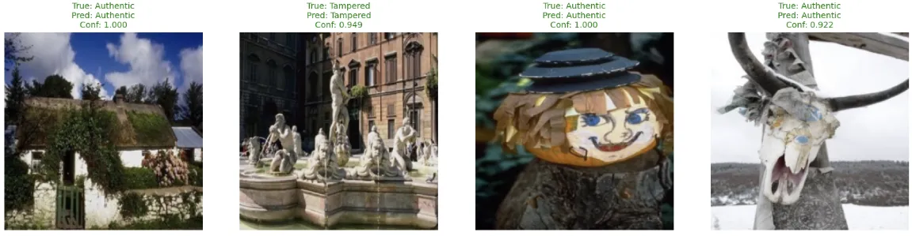
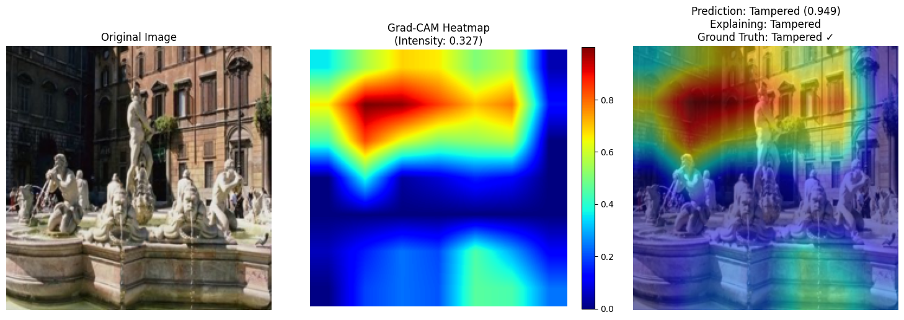

# AI-Powered Image Fraud Detection System

[](https://www.python.org/downloads/)
[](https://pytorch.org/)
[](https://opensource.org/licenses/MIT)

A computer vision system that detects copy-move tampering using EfficientNet-B0 with Grad-CAM interpretability - targeting a core manipulation technique prevalent across multiple fraud domains.

## 🎯 Project Overview

This project develops a computer vision system for detecting copy-move tampering - a fundamental image manipulation technique prevalent in fraudulent claims. Using EfficientNet-B0 with Grad-CAM interpretability, the system provides both accurate detection and explainable insights for fraud investigation workflows. While demonstrated on academic datasets, the architecture establishes a robust foundation for deployment across insurance, document verification, and financial fraud scenarios.

### Key Technical Features
- **Computer Vision Model**: EfficientNet-B0 fine-tuned for binary classification (authentic vs tampered)
- **Explainable AI**: Grad-CAM visualisations highlighting suspicious regions
- **Production API**: Flask deployment with real-time inference
- **Comprehensive Evaluation**: Performance analysis with multiple metrics and edge case studies

## 🔍 Model Performance Examples

### Multi-Image Classification Results

The system successfully identifies tampering with high confidence and provides clear visual explanations:

<div align="center">

<p><em><strong>Comprehensive Test Results</strong><br/>
Model accurately classifies both authentic and tampered images with high confidence across diverse scenarios</em></p>
</div>

### Grad-CAM Detection in Action

<div align="center">

<p><em><strong>Tampered Image Detection (Confidence: 94.9%)</strong><br/>
Grad-CAM heatmap highlights the suspicious regions where tampering was applied to the fountain scene</em></p>
</div>

## 🚀 Quick Start

### Installation
```bash
git clone https://github.com/GeorgeDep/fraud-detection.git
cd fraud-detection
pip install -r requirements.txt
```

### Training Notebook
The complete development process is documented in the Jupyter notebook:
- **GitHub**: [fraud-detection-notebook.ipynb](notebooks/fraud-detection-notebook.ipynb)
- **Google Colab**: [Open in Colab with Outputs](https://colab.research.google.com/drive/1k9pbt8GQSGEN5ETkzHCrjpwqdvMuSAN4?usp=sharing) *(recommended for full viewing experience)*

### Run Flask API
```bash
cd deployment/flask_api
python app.py
# Access at http://localhost:5000
```

## 🛠️ Technical Implementation

### Model Architecture
- **Base Model**: EfficientNet-B0 pre-trained on ImageNet
- **Dataset**: CASIA v2.0 (copy-move tampering detection)
- **Training**: 15 epochs with early stopping and learning rate scheduling
- **Performance**: Robust accuracy on copy-move detection with comprehensive evaluation

### Interpretability Features
- **Grad-CAM Implementation**: Highlights suspicious regions in tampered images
- **Multiple Analysis Types**: High confidence, edge cases, and comparative explanations
- **Business Value**: Provides fraud investigators with focused analysis areas

### API Capabilities
The Flask API provides real-time fraud detection with explanations:

```python
# Example API usage
import requests
import base64

# Load and encode image
with open('test_image.jpg', 'rb') as f:
    image_data = base64.b64encode(f.read()).decode()

# Make prediction with explanation
response = requests.post('http://localhost:5000/predict_with_gradcam', 
                        json={'image': image_data})
result = response.json()

print(f"Prediction: {result['prediction']}")
print(f"Confidence: {result['confidence']:.3f}")
```

## 📊 Results & Performance

### Training Performance
The model was trained using:
- **Data Augmentation**: Random flips, rotation, color jitter
- **Class Balancing**: Weighted loss function for imbalanced dataset
- **Optimization**: AdamW with ReduceLROnPlateau scheduling

### Evaluation Metrics
- Comprehensive test set evaluation with confusion matrix analysis
- ROC curve analysis for classification performance
- Confidence calibration assessment for prediction reliability

### Interpretability Analysis
- Grad-CAM visualisations for different prediction scenarios
- Comparative analysis showing model reasoning for both classes
- Edge case studies with detailed explanation patterns

## 🏗️ Repository Structure

```
fraud-detection/
├── notebooks/                    # Training and analysis notebooks
│   └── fraud-detection-notebook.ipynb
├── deployment/                   # Deployment configurations
│   ├── flask_api/               # Working Flask API
│   └── sagemaker/               # AWS deployment framework
├── models/                      # Trained model (16MB)
│   └── fraud_detection_complete_20250603_145722.pth
├── results/                     # Training results and visualisations
│   ├── gradcam_examples/        # Interpretability demonstrations
│   ├── api_demo_results/        # Live API test results
│   └── training_curves_*.png    # Performance plots
└── docs/                        # Technical documentation
```

## 🎯 Assessment Requirements Addressed

This project demonstrates practical application of computer vision and explainable AI:

- **Image Manipulation Detection**: Copy-move tampering identification using CASIA v2.0 dataset
- **Model Training & Validation**: EfficientNet-B0 with comprehensive evaluation metrics
- **Interpretability Implementation**: Grad-CAM for transparent decision-making
- **Production Deployment**: Working Flask API with real-time inference capabilities
- **Technical Documentation**: Complete development process and methodology

## 🔧 API Documentation

### Endpoints

**Health Check**
```
GET /health
Returns: {"status": "healthy", "model_loaded": true}
```

**Fraud Detection**
```
POST /predict
Body: {"image": "base64_encoded_image"}
Returns: {"prediction": "authentic|tampered", "confidence": 0.85}
```

**Detection with Explanation**
```
POST /predict_with_gradcam
Body: {"image": "base64_encoded_image"}
Returns: {
    "prediction": "tampered",
    "confidence": 0.87,
    "gradcam_available": true
}
```

## 🚀 Deployment Options

### Current Implementation
- **Local Flask API**: Fully functional with Grad-CAM integration
- **Model Storage**: Direct Git storage (16MB model file)
- **API Testing**: Comprehensive test suite with sample images

### Future Production Deployment
- **AWS SageMaker**: Framework prepared for cloud deployment
- **Container Deployment**: Docker configuration ready
- **Scaling**: Designed for horizontal scaling and batch processing

## 📈 Future Improvements

### Model Enhancement
- **Multi-tampering Detection**: Extend to splicing and retouching techniques
- **Ensemble Methods**: Combine multiple architectures for improved robustness
- **Real-time Processing**: GPU acceleration for batch processing

### Production Features
- **Model Monitoring**: Performance tracking and drift detection
- **Security**: Authentication and rate limiting
- **Integration**: Workflow integration with existing fraud investigation tools

## 📧 Contact & Demo

**Developer**: [George Deplitch]  
**Email**: [gldeplitch@gmail.com]  
**Repository**: https://github.com/GeorgeDep/fraud-detection

Available for technical discussion, live demonstration, and detailed explanation of implementation approach.

---

*This system demonstrates practical application of computer vision and explainable AI for real-world fraud detection, combining technical accuracy with business transparency requirements.*